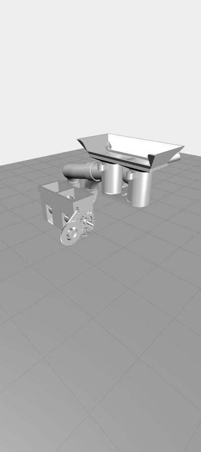

# Vuforia Studio Templates

Objective: Jumpstart users in creating AR experiences in Vuforia Studio by providing templates for specific use cases.

Available Vuforia Studio Templates:

1. [Maintenance/Assembly Template](https://github.com/PTC-Education/VuforiaStudioTemplates#Maintenance) - This template makes it easier to update a data table in ThingWorx from a Vuforia Studio experience. The purpose is to allow a user to update information regarding a process and its documentation automatically by going through the experience. 

2. [Machine Learning Template](https://github.com/PTC-Education/VuforiaStudioTemplates#Machine) - This template connects Vuforia Studio with Microsoft Lobe, a machine learning engine, that allows the user to train and test a model by taking pictures in Vuforia Studio and sending them to ThingWorx. The purpose is to allow the Studio experience to recognize parts/machinery that may not have CAD data.

[hello](https://github.com/PTC-Education/VuforiaStudioTemplates/blob/main/TW_Image_Training_Demo.zip)

<h2><a href="https://github.com/PTC-Education/VuforiaStudioTemplates/blob/main/TW_Image_Training_Demo.zip" download>Hello 2</a></h2>

## Maintenance / Assembly Template

This allows the user to import a Creo Illustrate file as an animation for maintenance or dis/assembly. Within the experience the template prompts for user input, such as name and notes, which is sent into ThingWorx datatable that can be accessed. The Template comes in two parts, the Vuforia Studio zip file and ThingWorx Datatable file.

## Machine Learning Template

